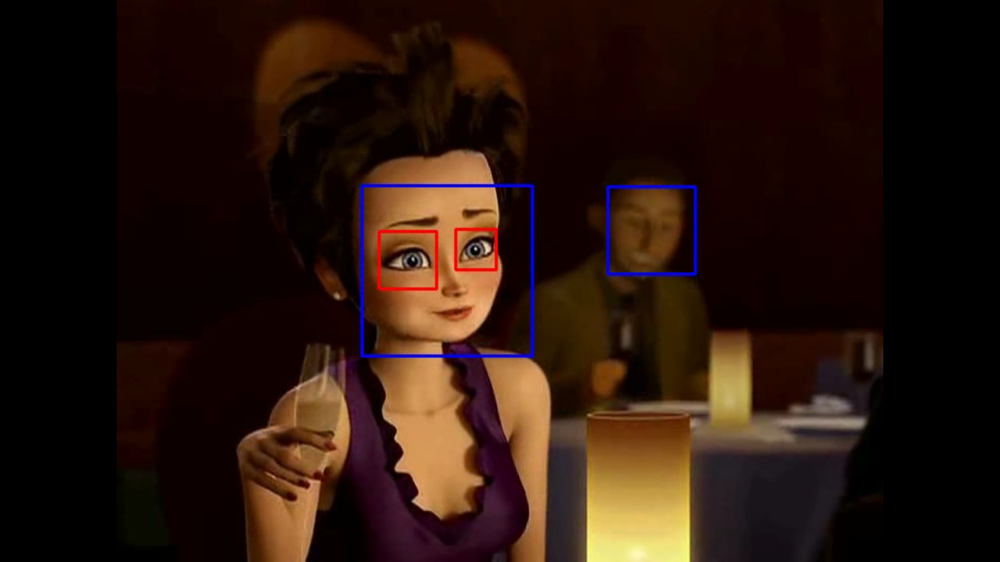

# Facial Recognition

Simple **OpenCV** code to detect faces and eyes in video streams with the help of *Haar Cascades*.
The processed video is saved as an avi video file.

The code is meant for processing video files, but with some minor changes, it can be used to detect faces (and eyes) in live video streams and/or images.

---

**A still for original video:**

---

**Still from Processed Video:**

